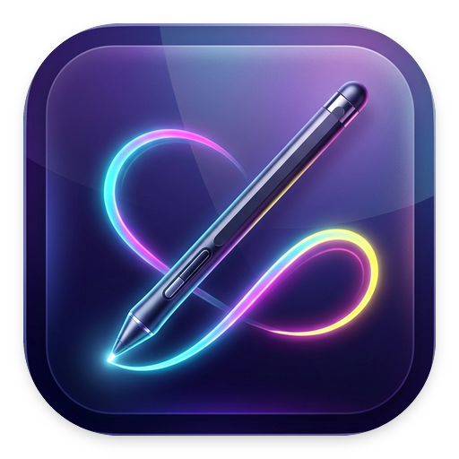

<p align="center">
  
</p>

<p align="center">
  <b>Fast, minimalist, elegant screen drawing & annotation tool for Linux</b>
  <br />
  <i>Lightweight • Glassmorphic UI • Instant Dismiss • Multi-Monitor Ready • Powered by uv</i>
</p>

<p align="center">
  <a href="README.md"><b>English</b></a> |
  <a href="README_FA.md"><b>فارسی</b></a>
</p>

**Ghalam** (Persian for *"Pen"* / *قلم*) is a modern, lightweight on-screen annotation utility designed for Linux
desktops (optimized for KDE Plasma & Wayland, X11, and cross-platform).

Triggered instantly with a global keyboard shortcut, it displays a transparent, distraction-free canvas over your
screen. You can sketch ideas, highlight text, draw precision arrows, annotate bugs, or stamp step-by-step badges.
Pressing **`Esc`** clears everything instantly and terminates the process cleanly without leftover background jobs.

## Key Features

- **Full Drawing Suite**:
    - **Freehand Pen**: Anti-aliased, smooth quadratic Bézier interpolation.
    - **Highlighter**: Translucent fluorescent marker for emphasizing text and UI elements.
    - **Smart Arrow**: Directional arrows with calculated geometric heads.
    - **Shapes**: Rounded rectangles and circles/ellipses.
    - **Step Counter Badges (①, ②, ③...)**: Automatically incrementing numbered pins for documentation and bug
      reproduction steps.
    - **Inline Text Tool**: Click anywhere to type notes and labels with high-contrast backing.
- **Distraction-Free & Floating Glassmorphic Toolbar**:
    - **Visible by default & draggable**: Centered at the bottom, ready for instant tool/color picking.
    - **Instant toggle with `Tab` or `Space`**: Quickly hide or show the floating Obsidian glass card anytime.
      and crisp across both pure white documents and dark themes.
    - Draggable anywhere across monitors.
    - Quick cycle stroke size button and mouse scroll wheel resizing.
- **Multi-Monitor & Fractional Scale Support**:
    - Automatically identifies the active display via KWin DBus.
    - Supports heterogeneous scaling (e.g. 100% on DisplayPort + 75% on HDMI).
    - Quick monitor hopping with **`M`** or span all monitors simultaneously with `--monitor all`.
- **Clean Termination**:
    - Pressing **`Esc`** or the **`✕`** button cleans up memory and immediately terminates the process.
    - Full `Ctrl+C` (SIGINT) support in terminal.
- **One-Click Share**:
    - **`Ctrl + C`**: Copies the composite screenshot with your annotations directly to the system clipboard.
    - **`Ctrl + S`**: Saves the screenshot to `~/Pictures/Screenshots`.
- **Powered by `uv`**:
    - Zero dependency setup friction; sub-millisecond start time with lockfile precision (`uv.lock`).

## Keyboard Shortcuts

| Shortcut                                 | Description                                                                |
|------------------------------------------|----------------------------------------------------------------------------|
| **`Esc`** or **`✕`**                     | **Instantly dismiss, clear all annotations, and quit**                     |
| **`Tab`** or **`Space`** or **`V`**      | **Toggle Toolbar panel visibility (Show / Hide)**                          |
| **`P`**                                  | Pen tool (smooth freehand drawing)                                         |
| **`H`**                                  | Highlighter tool (translucent marker)                                      |
| **`A`**                                  | Arrow tool (directional pointer)                                           |
| **`R`**                                  | Rectangle tool (rounded boxes)                                             |
| **`O`**                                  | Circle / Ellipse tool                                                      |
| **`T`**                                  | Text tool (click on canvas to type)                                        |
| **`N`**                                  | Numbered Step Badge (1, 2, 3...)                                           |
| **`1` – `7`**                            | Quick Color Presets (Neon Green, Cyan, Red, Yellow, Orange, Purple, White) |
| **`Mouse Wheel`**                        | Increase / decrease brush stroke width                                     |
| **`M`**                                  | Switch overlay between connected monitors                                  |
| **`Ctrl + Z`**                           | Undo previous action                                                       |
| **`Ctrl + Y`** or **`Ctrl + Shift + Z`** | Redo previous action                                                       |
| **`C`**                                  | Clear all drawings on canvas                                               |
| **`Ctrl + C`**                           | Copy annotated screenshot to clipboard                                     |
| **`Ctrl + S`**                           | Save screenshot to disk (PNG)                                              |

## Getting Started

### 1. Requirements

- Python `>= 3.10`
- [uv](https://github.com/astral-sh/uv) (recommended) or standard `python3-venv`

### 2. Installation & Setup

Clone the repository into `/opt/ghalam` and run the installer script:

```bash
# Clone to /opt/ghalam
sudo git clone https://github.com/mryazdan/ghalam.git /opt/ghalam
sudo chown -R $USER:$USER /opt/ghalam

# Run installer
cd /opt/ghalam
./setup.sh
```

The installer (`setup.sh`) automatically:
1. Links the terminal launcher command (`ghalam`) to `~/.local/bin/ghalam`.
2. Installs the desktop entry and system icons.
3. Configures the global shortcut (default: **`Meta + Shift + A`**).

#### Custom Shortcut (Optional)

You can specify any custom shortcut during setup:

```bash
./setup.sh "F8"
# or
./setup.sh "Ctrl+Alt+A"
```

### 3. Launching Ghalam

Once installed, you can launch Ghalam anytime by:

1. Pressing your shortcut (**`Meta + Shift + A`**)
2. Running `ghalam` in any terminal
3. Searching for **Ghalam** in your desktop application menu

*(You can also run Ghalam directly without installing shortcuts using `./run.sh`)*

## Multi-Monitor Options

Ghalam automatically detects which monitor you are working on. You can also specify display targets:

```bash
# Annotate simultaneously across all connected monitors:
ghalam --monitor all

# Force specific monitor:
ghalam --monitor hdmi
ghalam --monitor dp
```

## License

Open-source under the [MIT License](LICENSE).
